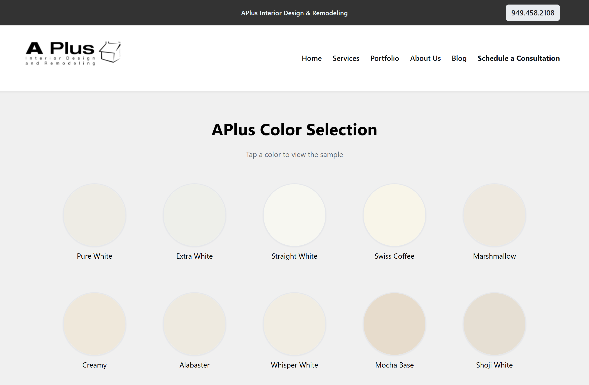

## APlus Color Selection

  # License
  
  
  
## Description
  
  - APlus-Color-Selection is a curated collection of all available color samples for our custom kitchen cabinets. This repository serves as a digital catalog where customers, designers, and team members can explore the different finishes, tones, and styles we offer. Each sample includes its name and visual representation.

## Launched Site: https://aplus-color-selection-1.onrender.com

  
## Features
  
  - Shows the Vast collection of color finishes, tones, and styles we offer.

  - Click on a color you'd like to see more information on.

## Usage
  
  - For customer color selection for their custom made cabinets.
  
  
## Questions
  
  - https://github.com/CrisSal2
  
  - salgado.chris.m@gamil.com
  
